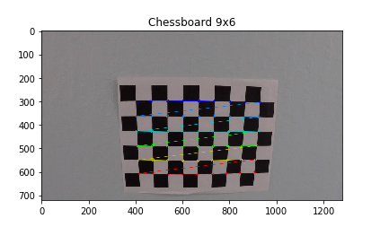
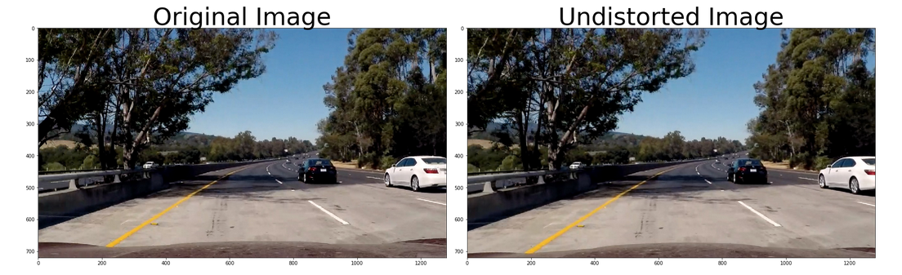
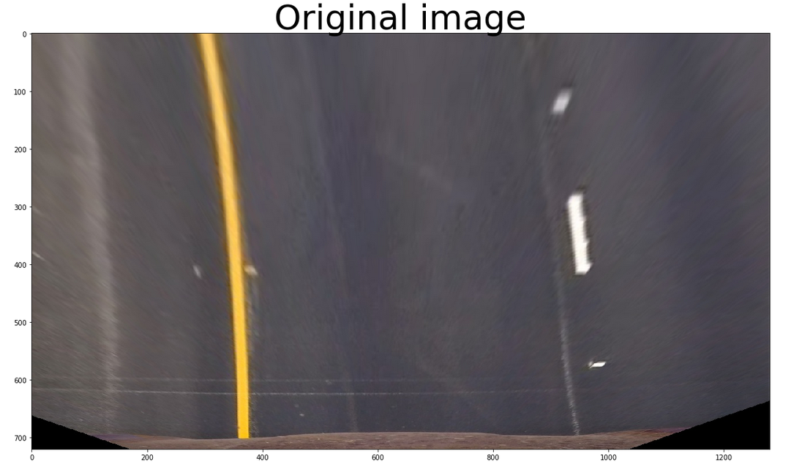
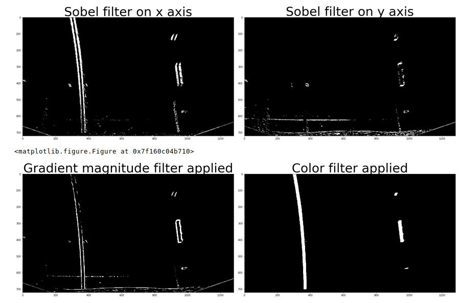

<<<<<<< HEAD
## Advanced Lane Finding

The Project
---

The goals / steps of this project are the following:

* Compute the camera calibration matrix and distortion coefficients given a set of chessboard images.
* Apply a distortion correction to raw images.
* Use color transforms, gradients, etc., to create a thresholded binary image.
* Apply a perspective transform to rectify binary image ("birds-eye view").
* Detect lane pixels and fit to find the lane boundary.
* Determine the curvature of the lane and vehicle position with respect to center.
* Warp the detected lane boundaries back onto the original image.
* Output visual display of the lane boundaries and numerical estimation of lane curvature and vehicle position.

## Camera calibration

One of the problems that appear when we deal with the camera is the camera distorsion that appears because of the fact that cameras use curved lenses to form an image, and light rays often bend a little too much or too little at the edges of these lenses. 
To correct those problems I used two functions, cameraCalibration() and undistortImage().

#### Find chessboard corners
The first one takes a colection of camera pictures of a chessboard table and finds the corners of each of the pictures (converted previously to grey scale), using the function cv2.findChessboardCorners() - which will be 9x6. After that, the function cv2.calibrateCamera() is used to find the mtx and dist matrixes that contain the camera parameters.
Those parameters are then saved to the "camera_cal/wide_dist_pickle.p" file.

#### Undistort the image
The second function use the parameters saved in the "camera_cal/wide_dist_pickle.p" file and runs the cv2.undistort() function.
The image retured by this image is an undistorted image.

## Image thresholding

For the image thresholding part I used two different types of filtering including gradient based filtering and color based filtering. 
For the gradient filtering I used three thresholds, two for sobel threshold (oriented on the 'x' si 'y' axes) and one for gradient magnitude. In code, I wrote the functions abs_sobel_threshold() and mag_threshold() for those operations.
After the gradient thresholding, I wrote a color filtering function that takes the image and applies three color filters on it, one for the S and L channels of the HLS color space and one for the R channel in the RGB color space (this is used for a better yellow filtering).
The thresholds and parameters that I used for the gradient and color filtering are as it follows:
- sobel threshold for the x and y axes is set at 20 for the low threshold and 100 for the high one;
- gradient magnitude threshold is set at 30 for the low threshold and 100 for the high one;
- the color thresholds are as it follows:
    - for the S channel, I set the threshold at 100 -> 255
    - for the L channel, I set the threshold at 180 -> 255
    - for the R channel, I set the threshold at 150 -> 255
    - all of those filterings are then combined in one big filter

=======
# Self-driving-car---Projects
Udacity repository for all the projects
>>>>>>> cf373546a54a5a65d578d4704b5b03fa0bc6167a
