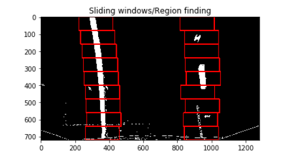

## Advanced Lane Finding

The Project
---

The goals / steps of this project are the following:

* Compute the camera calibration matrix and distortion coefficients given a set of chessboard images.
* Apply a distortion correction to raw images.
* Use color transforms, gradients, etc., to create a thresholded binary image.
* Apply a perspective transform to rectify binary image ("birds-eye view").
* Detect lane pixels and fit to find the lane boundary.
* Determine the curvature of the lane and vehicle position with respect to center.
* Warp the detected lane boundaries back onto the original image.
* Output visual display of the lane boundaries and numerical estimation of lane curvature and vehicle position.

## Camera calibration

One of the problems that appear when we deal with the camera is the camera distorsion that appears because of the fact that cameras use curved lenses to form an image, and light rays often bend a little too much or too little at the edges of these lenses. 
To correct those problems I used two functions, 'cameraCalibration()' and 'undistortImage()'.

#### Find chessboard corners
The first one takes a colection of camera pictures of a chessboard table and finds the corners of each of the pictures (converted previously to grey scale), using the function 'cv2.findChessboardCorners()' - which will be 9x6. After that, the function 'cv2.calibrateCamera()' is used to find the mtx and dist matrixes that contain the camera parameters.
Those parameters are then saved to the "camera_cal/wide_dist_pickle.p" file.

#### Undistort the image
The second function use the parameters saved in the "camera_cal/wide_dist_pickle.p" file and runs the cv2.undistort() function.
The image retured by this image is an undistorted image.

## Image thresholding

For the image thresholding part I used two different types of filtering including gradient based filtering and color based filtering. 
For the gradient filtering I used three thresholds, two for sobel threshold (oriented on the 'x' si 'y' axes) and one for gradient magnitude. In code, I wrote the functions 'abs_sobel_threshold()' and 'mag_threshold()' for those operations.
After the gradient thresholding, I wrote a color filtering function that takes the image and applies three color filters on it, one for the S and L channels of the HLS color space and one for the R channel in the RGB color space (this is used for a better yellow filtering).
The thresholds and parameters that I used for the gradient and color filtering are as it follows:
- sobel threshold for the x and y axes is set at 20 for the low threshold and 100 for the high one;
- gradient magnitude threshold is set at 30 for the low threshold and 100 for the high one;
- the color thresholds are as it follows:
    - for the S channel, I set the threshold at 100 -> 255
    - for the L channel, I set the threshold at 180 -> 255
    - for the R channel, I set the threshold at 150 -> 255
    - all of those filterings are then combined in one big filter
    

## Perspective Transformation

The perspective transform is made using the function 'perspectiveTransform'.
We need to have a source and a destination for the transform so I chose manually 4 points for each source and destination. Here it is an example of a perspective transform with a polygon drawn usign the source points.

From the perspective transform function I also return the MInv matrix which will be used for the perspective invere trasform which will bring our perspective to the original one.
'warped, Minv = perspectiveTransform(image)'

## Identify the lane-lines

To identify the lane-line pixels I used two functions, 'find_lane_pixels()' and 'fit_polynomial()'. 
The first one is used to find the regions in the image that contain the lane and to mark them (the program saves point coordinates for each window). The second one takes the regions that the first one have recently found and compute a second order polynomial that fits over those regions/points. To do this, the function 'numpy.polyfit()' is used and it takes 3 arguments, the y coordinates of points, the x coordinates and the order of the output polynomial. That function will generate an aproximate extrapolation of those points.

## Calculation of the radius of curvature

To determine the radius of curvature in meters I used the polynomial that I've computed already and using the radius of curvature formula I found the result. The result of that formula was based on pixels dimension so I had to change that to meters. To emphasize that I used two metric conversion, one for the x axis and one for y axes, and those conversions are as it follows:
    - 'ym_per_pix = 30/720'  -> which means that we have 30 meters in 720 pixels on y axis
    - 'xm_per_pix = 3.7/700' -> which means that we have 3.7 meters in 700 pixels on x axis
Also, the distance to the center of the lane is computed using the distance to the right and left polynomials and then compute the conversion to meters.
    - left_pos = abs(0 - polynomial_of_left(bottom_y))
    - right_pos = abs(x_dimension_of_image - polynomial_of_right(bottom_y))
    - position = (left_pos - right_pos) * xm_per_pix

## Final Results

Here you can see some of the final results provided by the lane detection algorithm. 

## Videos pipeline

For the video test I used the moviepy.editor library to manage the videostream and I implemented a mechanism that verify the lane result and checks if it is far from the last detection. If this detection is catastrophic, then the current results corrects itself with the last good result provided. Using this method it can be sure that we have a smoother detection of lanes.
For this implementation I used the class 'Line()' provided in the previous files with two objects, 'leftLine()' and 'rightLine()' for each of the lines. The check is made in 'fit_polynomial' function.

